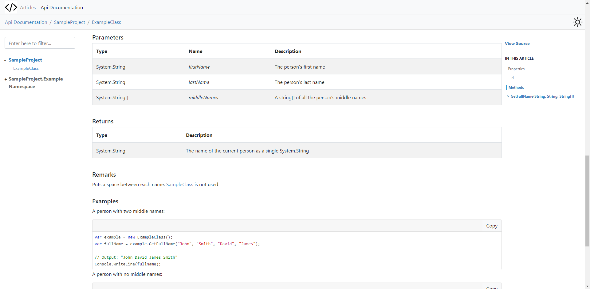
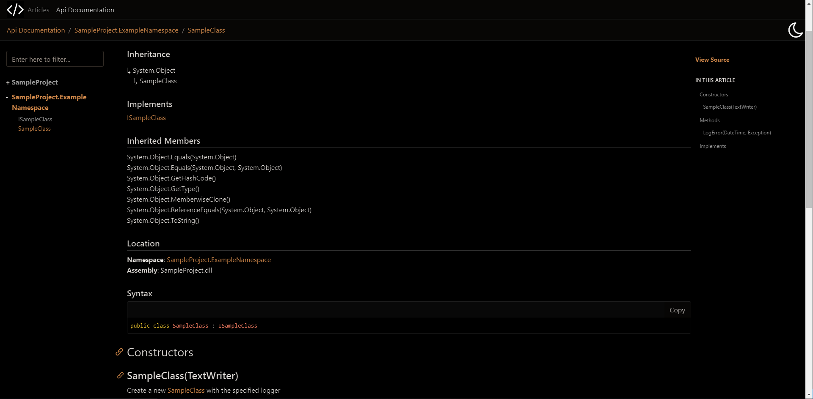

# PhnxDocs
A custom DocFX template with a light and dark theme, and a heavy focus on readability

# Screenshots

# How To

## Configuration

The sample project's build is configured by a dependency on `docfx.console`, and a reference to the `Theme/Clean` folder.
To change this to run your own builds, add `docfx.console` to your solution, and edit the `templates` section in `docfx.json` to use the `Theme/Clean` (you'll need to edit the relative path according to where the `Theme/Clean` folder is to your docfx.json file)

## Build the Sample

1. Clone or fork the repository

1. Open `Sample/SampleProject.sln` in Visual Studio
1. Build the solution
1. A new folder in `Sample` called `SampleProject.Site` will be generated
1. Open that folder with a server that can serve static files (such as [http-server](https://www.npmjs.com/package/http-server)), and you will be able to browse generated documentation site

# Editing the Theme (`Theme/Clean`)

> #### If you're changing dependencies on 3rd party JS/ CSS
> 1. All dependencies are managed by Node Package Manager, so make sure you have npm installed. If you don't already have npm installed, you can install npm as part of [node.js](https://nodejs.org/en/download/)
> 1. Navigate to the template folder (`Theme/Clean`) in a terminal
> 1. Run `npm install` to install all packages
> 1. If you want to add, change or remove a dependency, make sure to update `gulpfile.js` with your changes, as this is the file that configures which items go into `docfx.vendor.js` and `docfx.vendor.css`
> 1. Run `npm run gulp` to build `docfx.vendor.js` or `docfx.vendor.css`
> 1. It is recommended that once you're happy with your changes to 3rd party JS/ CSS and have run `npm run gulp`, you remove the `node_modules` folder generated by `npm install`. This is not a necessary step, but it will make docfx builds much quicker

* The main (non-vendor) JS and CSS files for the site are located in `styles`, and are `docfx.js` and `docfx.css` accordingly

* The site builds HTML using the master page (`layout/_master.tmpl`), which in turn uses a combination of partial views (in the `partials` folder)
